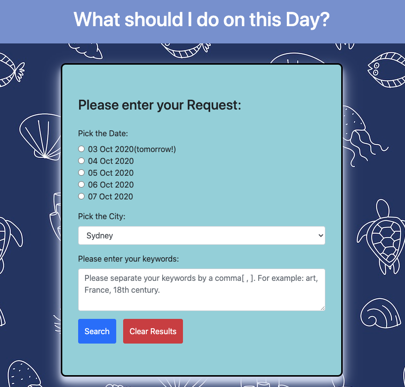
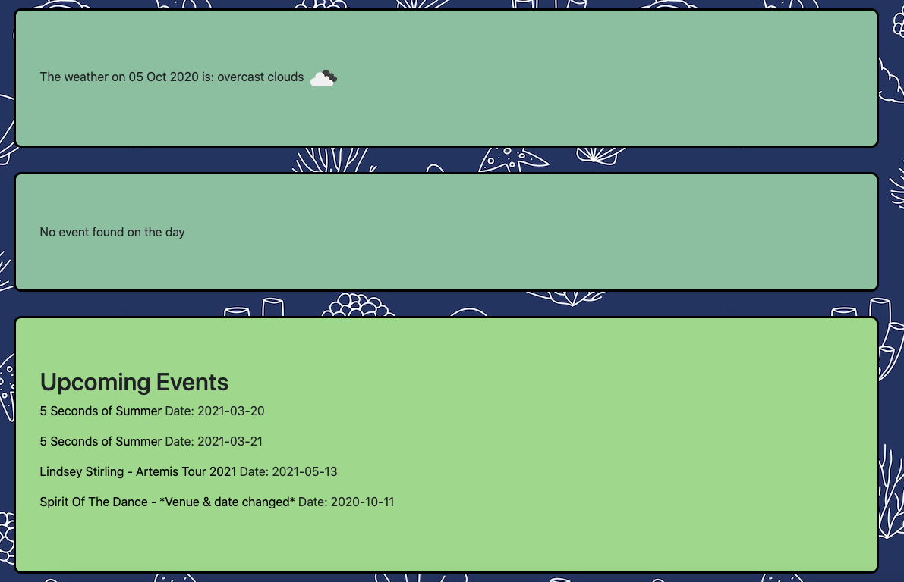
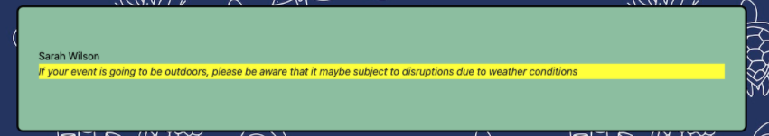

# Project 1

## Project overview (breakoutroom 4)

Project Description

This project entails the usage of 2 APIs which will then assist the user to select the most appropriate event with the user-specified date and location with weather forecast.This application is mobile responsive and has accessibility features included.

## Deployment

https://cherylfowlie.github.io/project-1/

## Tech Used

- HTML5
- CSS3
- jQuery
- JavaScript
- Moment.js
- Bootstrap 4
- APIs (OpenWeatherAPI and TicketMaster)

## Screenshots 

Screenshot 1) User is given the simple UI to input the date, city and prefered keywords for event search.

Screenshot 2) the result displays the weather on that day and events. If no events, it displays the future events.

Screenshot 3) if there is an event on the day and the weather is bad, it pops a warning message. 

## Contact
Noriyuki Ishii: https://www.linkedin.com/in/ishiinoriyuki/
Atif Haque: https://www.linkedin.com/in/atif-haque-2064bb11b/

